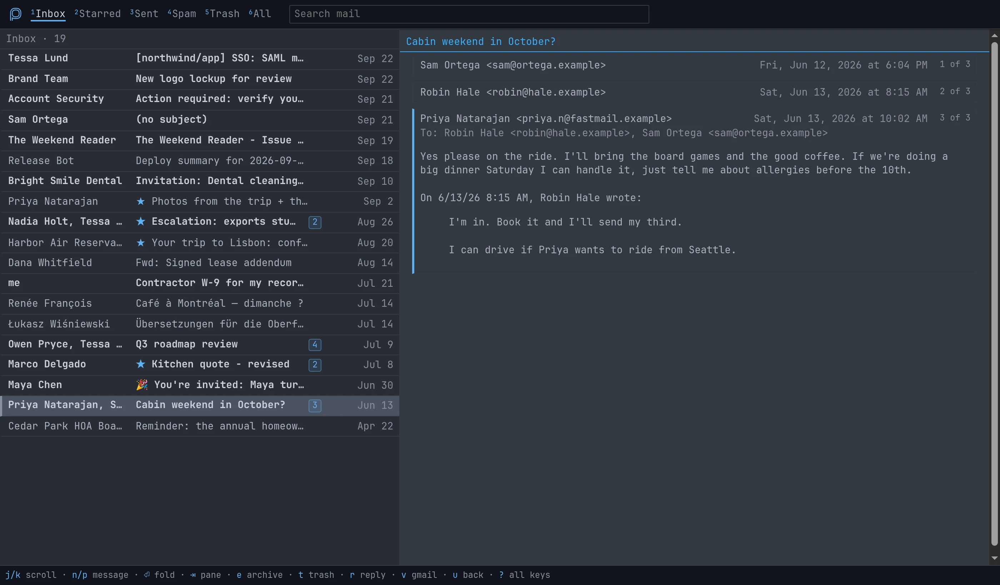

<picture><source media="(prefers-color-scheme: dark)" srcset="brand/stamp-inked-dark.webp"></picture>

<picture><source media="(prefers-color-scheme: dark)" srcset="brand/wordmark-paper.svg"></picture>

pneu is a Gmail client designed for Omarchy. It is themeable and keyboard first.

In true Linux fashion, pneu is built from other specialized and battle tested tools. [lieer](https://github.com/gauteh/lieer) handles all Gmail syncing via API. [notmuch](https://notmuchmail.org/) stores and indexes your email. All that's needed is a Go server for the front end. As an added benefit, you'll have a complete copy of your email archive, locally.

Compatible with multiple mailboxes, both standard Gmail and Google Workspace accounts.

# Installation

Ask your agent to follow [INSTALL.md](INSTALL.md). It will walk you through the process and address any questions or concerns.

pneu runs in one of two roles. A **server** holds your mail: it runs lieer, keeps the archive, and serves the app. A **client** keeps no mail at all; it shows a server's inbox over Tailscale, so a laptop can use the archive on your desktop without syncing its own copy. Most people start with one server; any other machine can be paired as a client later. The installer asks which you're setting up.

Because lieer syncs via API, you'll need to create a Google application to use oauth credentials, on the server only. The installer will guide you. This also ensures you'll have complete control of your authentication; nothing is shared with other users or me.

# Widget

Includes two top bar widgets: a standard version with notification and a minimal option that will get out of your way.

# Histoire

The 'pneu' name is inspired by the *pneumatique* system that ran below the streets of Paris (1866-1984). It was a technological marvel of its time, promising letters could be sent across the city within the hour.
