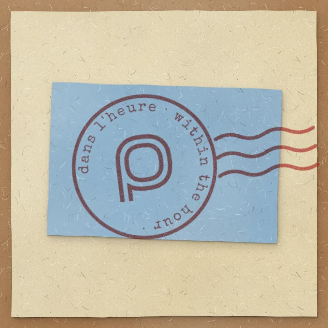

# pneu: the brand

pneu is named for the Paris *pneumatique*: a letter went by tube under the city and
arrived within the hour, on a blue card Parisians called a *petit bleu*. The brand is
that letter's postmark. The mark is the postmark's centre, a **p drawn as a tube**:
two walls with the bore between them, open at the foot of the stem where the letter
comes out.

It belongs to the same family as Omarchy's own icon without copying it. Both are drawn
on a 15 × 15 grid with walls one unit thick, and Omarchy's two rings become the tube's
two walls.

## The mark

Two cuts of one design. Use the one that fits the size; never scale one into the
other's range.

| file | cut | use |
|---|---|---|
| `mark.svg` | drawn | from about 22 device px up: the window header (18 CSS px on a HiDPI screen), icons 48 and up, the page, print |
| `mark-pixel.svg` | pixel | where the mark must be smaller than that: the bar, 16 and 32 px icons, favicons. Whole multiples of 15 **device** pixels only (a whole number of device pixels per unit), with `shape-rendering: crispEdges`. At fractional scale that means sizing from `devicePixelRatio`, not a fixed CSS size |

**Why two cuts.** The drawn cut needs about one and a half device pixels per unit
(22 device px for the whole mark) before the gap between its walls holds. Below that,
antialiasing smears the gap on the curves to grey and the p goes to mush. Round rects stay
sharp because straight runs land on whole pixel rows; that's why they shrink well.
The pixel cut keeps the round bowl and lays every wall on a pixel row by hand, the way
Omarchy's icon is drawn. It is exact but stepped, so use it only where the drawn cut
can't hold: at a size where the pixel steps show, the drawn cut reads better. In the
window header, the pixel cut at 15 device px looked rough beside the type, and the
drawn cut at 22.5 did not.

**Geometry** (for redrawing, not for tweaking): 15 × 15 units. The bowl is a
superellipse, |x|^2.6 + |y|^2.6 = r^2.6, about (7.5, 6.5), with the outer wall's
centreline at r 6, the inner at r 4, and walls 1 unit thick. The stem's walls run down
x 1.5 and 3.5 to the foot, open. The outer wall leaves the bowl where it meets the
stem's inner wall. n 2.6 is "nearly round": it reads as a circle, with a little more
body at the shoulders.

Both cuts use `currentColor`. Inline them to take the colour of their surroundings.

## Colour

| | | |
|---|---|---|
| petit bleu | `#86aecb` | the card; the app icon's ground |
| stamp red | `#a8261f` | the ink: the mark on the icon, the stamp |
| ink | `#221c1d` | the name on paper |
| paper | `#e2d3ab` | manila, the ground behind the stamp |

**Inside the app, the mark takes the theme**: `currentColor`, set from the theme's
`--accent` (or `--fg`), never the fixed brand colours. pneu follows the Omarchy theme
and the mark follows with it. The fixed colours are for things that exist outside a
theme: the app icon, the favicon, the README, printed matter.

## The name

- **Always lower case: pneu.** In the pen, Beth Ellen, outlined, no font needed:
  `wordmark.svg` (currentColor, for inlining), `wordmark-ink.svg` (on light
  grounds), `wordmark-paper.svg` (on dark). As an ``, currentColor renders
  black, so use the fixed pair in a `<picture>` with `prefers-color-scheme`.
- **Keep the mark and the name apart.** There is no lockup file on purpose. Set them
  with generous room, or use only one. Never let the p stand in for the first letter
  of the word.
- The app's UI keeps its own mono face and the theme font. The pen is for the name
  only.
- **Lower case everywhere**, prose included: at the start of a sentence, in the
  window title, the desktop entry, the manifest and tooltips.

## The postmark

`stamp.svg`: the mark inside a ring of text with the three cancellation waves beside
it. Special Elite, outlined. It appears only where there's room for the waves: the
README, a page header, print. Below that, the mark goes alone.

Ring texts are French, then English, lower case, joined by middle dots.

- **dans l'heure · within the hour ·** is the stamp. It's the pneumatique's promise.
- **sous la ville · under the city ·** (`stamp-sous-la-ville.svg`) is held for other
  uses. It describes the route and quietly describes pneu too: lieer and notmuch
  work underneath, out of sight.

**Printed, not drawn.** On pages, use the inked export: `stamp-inked.webp` and
`stamp-sous-la-ville-inked.webp` (1500 × 900, transparent, for up to 500 CSS px wide
at 3×). The press is baked in: a slight bleed, a rough edge and uneven ink, sized so the
p's walls never close. Every part goes through the same press, so the thin walls no
longer look softer than the thick ring. Baking it rather than filtering it on the page
keeps it identical in every browser and costs nothing at runtime. On a light ground,
set it with `mix-blend-mode: multiply` so the paper's fibres show through the ink, as
they would. On a dark ground, use normal blending. The SVGs stay for print and for
anywhere that needs a vector.

The stamp keeps its three waves. Two waves read as stink lines, and the waves never
go on the small mark.

## Sizes

| size | what |
|---|---|
| page, README | the inked postmark (`stamp-inked.webp`), or the paper stamp (`stamp-paper.webp`) |
| print | the postmark (`stamp.svg`) |
| 48 to 512 | app icon, drawn cut: `icon.svg`, `icon-{48,64,120,128,256,512}.png` |
| 16, 32 | app icon, pixel cut: `icon-small.svg`, `icon-16.png`, `icon-32.png` |
| favicon | `favicon.svg` (the pixel cut on the tile) |
| window header | `mark.svg` inlined at 18 CSS px (22.5 device px at 1.25×), in the theme's colour. Softer on a 1× screen |
| bar | `mark-pixel.svg` at one device pixel per unit, rounded from the display's scale (15 device px at 1×, 30 at 2×), in the theme's colour |

`icon-120.png` is the size Google's OAuth consent screen asks for.

## Tried and dropped

So they don't come back by accident:

- **A capsule in the tube.** It doesn't read at small sizes.
- **Two squiggles beside the mark.** Stink lines.
- **An oval (wide) bowl.** It looks bad. The earlier "wide proportion" was right only
  for a rectilinear p.
- **A rectilinear p on Omarchy's grid.** The tie to Omarchy's icon was liked, but the
  result was too boring.
- **A round-rect bowl.** It shrinks well but reads worse than round. The pixel cut
  solves shrinking instead.
- **Mono type for the name.** Too plain; the pen won.

## Source

The mark shares an identity with the author's desktop, where the paper stamp was cut.
The design history and the exporter that writes these files live with that work, not
in this repo. The files here are the output: don't hand-edit them, re-export. The one
copy is `shell/BarWidget.qml`, which draws `mark-pixel.svg`'s runs as rectangles, so
a change to the pixel cut has to be made there too.

Beth Ellen is OFL; Special Elite is Apache 2.0. Both are outlined in the SVGs, so
nothing here loads a font.
